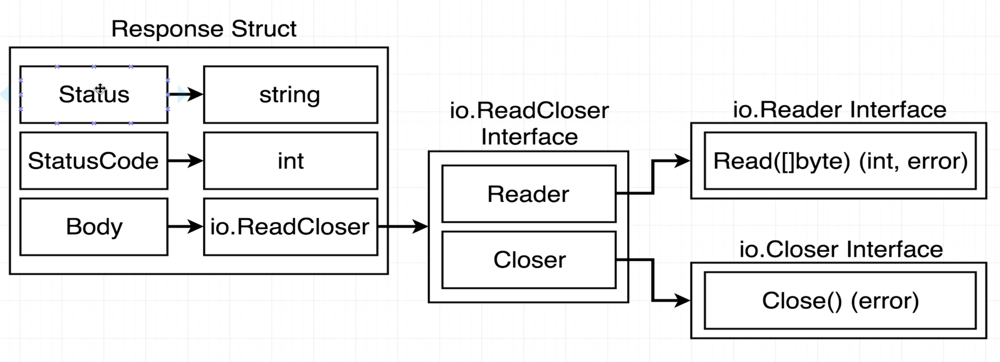
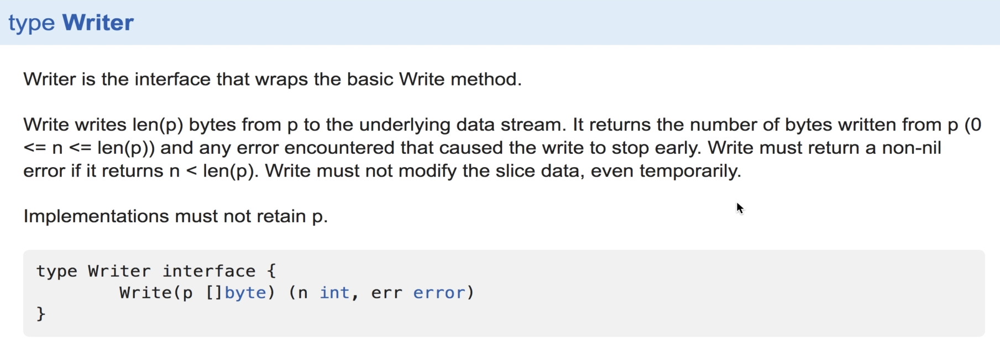

#   ReadCloser
-   body os response (resp) is of type io.ReadCloser > an interface
-   means that we can get anything as response as long as it satisfies the read closer interface

#  Reader and Closer
-   these are interfaces within ReadCloseer interface
##  Reader
-   we hv many sources of data that give different types of data, hence we make an interface to deal with all kinds of inputs   
-   outputs data as `[]byte` that everyone can work with

#  Read function 
-   is not set to automatically increase the size of byte slice, so it only copies the values into the slice until the slice is full. so we make a very large byte slice

#   Writer interface
-   to satisfy type interface, your type must implement a function Write(p []byte) (n int, err error)
-   an interface that wraps the basic write method.
-   takes `byte slice` as input and outputs data in required form >
    -   as http request
    -   image/ text file on hard drive
    -   terminal
