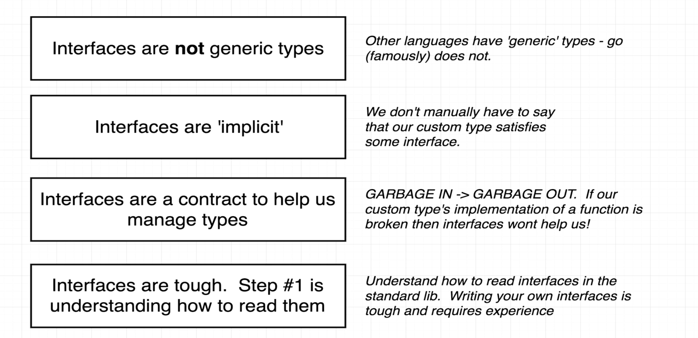

```
type bot interface {
	getGreeting() string
}
```
-   meaning
    -   if u are a `type` in this program with a function called getGreeting() that returns a string then u r now an honorary member of type bot
    -   means that englishBot and spanishBot both now also are of `type bot`

-   we can list out as many function inside an interface that we want. to qualify for that interface all function requirements should be satisfied

#   type
-   two types concrete type > map, struct, int, string, englishBot
              interface type > bot



-   go also offers standard interfaces